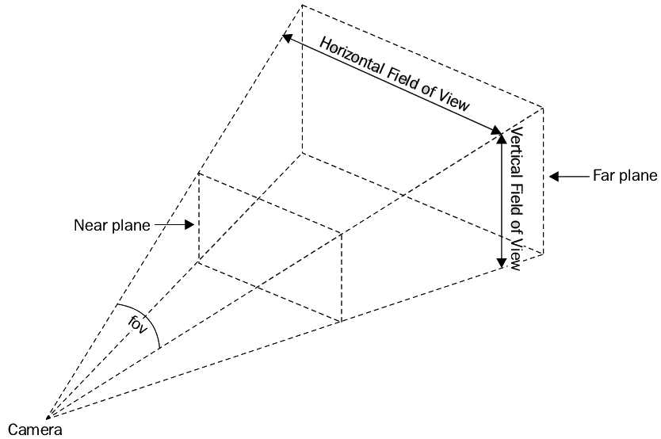

# WebGL 与 3D 基础概念

## 一、概述

在正式开始 Three.js 的学习之前，我们需要对 3D 图形学的基本概念及 WebGL 的基础原理有一个初步了解。本章节将帮助你建立对 3D 场景的空间认知，并理解浏览器中 3D 渲染的基本流程。

## 二、3D 坐标体系与透视原理

### 2.1 坐标系基础

在 3D 场景中，我们通常使用三个相互垂直的轴线来定义坐标系：

- **X 轴**：通常为**水平**方向，正向为右。
- **Y 轴**：通常为**竖直**方向，正向为上。
- **Z 轴**：**深度**方向，正向为向屏幕外延伸。

通过为场景中的每个点指定 `(x, y, z)` 坐标，我们可以在三维空间中确定物体的位置。

### 2.2 摄像机与视图

摄像机（`Camera`）决定了我们从哪个角度、距离以及以何种投影方式观察场景。常见的摄像机类型包括：

- **透视摄像机（Perspective Camera）**：模拟人眼视角，**远处物体看起来更小**，从而产生**透视效果**。
- **正交摄像机（Orthographic Camera）**：无透视缩小效果，**远近物体大小不变**。

### 2.3 投影与视锥

透视投影会将 3D 空间的物体映射到 2D 屏幕平面上。摄像机的可见范围通常由**视锥（View Frustum）**来定义。视锥由**近截面**、**远截面**以及**水平与垂直方向的视场角度**（`FOV`）组成。只有位于视锥内的物体才会被渲染显示。

**示意图（View Frustum）**如下：



从摄像机位置看向视锥内部，当物体落在近截面与远截面之间的空间中时，它将被投影到屏幕上。距离摄像机越远，物体在最终显示中越小。

## 三、WebGL 的工作原理简述

### 3.1 什么是 WebGL

**WebGL**（Web Graphics Library）是一组**在浏览器中调用 GPU 的 API**。利用 WebGL，可以在网页中不借助插件直接渲染硬件加速的 2D、3D 图形。

### 3.2 渲染管线基础

WebGL 的渲染流程类似于一条流水线，由以下关键步骤组成：

1. **顶点着色器（Vertex Shader）**：处理每个顶点的坐标变换和属性计算。
2. **图元装配与光栅化（Primitive Assembly & Rasterization）**：将顶点构成的几何图元（如三角形）转换为像素网格。
3. **片元着色器（Fragment Shader）**：为每个像素（片元）计算最终颜色，包括光照、纹理映射、阴影等。

**示意图（WebGL 渲染管线简化）**：

```plaintext
[顶点数据] -----> (顶点着色器) -----> [图元装配] & [光栅化] -----> (片元着色器) -----> [帧缓冲显示]
```

### 3.3 示例：一个简单的三角形

假设我们要在屏幕上绘制一个简单的三角形：

- **顶点着色器**：将定义三角形三个顶点的 `(x, y, z)` 坐标从模型空间变换到屏幕坐标。
- **图元装配与光栅化**：将这三个顶点连成三角形，并决定该三角形覆盖哪些屏幕像素。
- **片元着色器**：为每个覆盖的像素定义颜色（例如纯红色），最终，你在屏幕上看到一个红色三角形。


## 四、为什么选择 Three.js

直接使用 WebGL 需要处理**着色器编写**、**投影矩阵计算**、**缓冲区管理**等复杂细节。**Three.js** 为这些繁杂的底层操作提供了高级封装。你可以：

- 创建 **Scene（场景）**：管理 3D 空间与对象的容器。
- 创建 **Camera（摄像机）**：定义观察角度、距离与投影方式。
- 创建 **Mesh（网格对象）**：将 **Geometry**（几何形状）和 **Material**（材质）组合成可渲染物体。
- 添加 **Light（光源）**：让物体呈现出阴影、光泽和纹理细节。
- 使用内置函数轻松调整投影、加载模型和纹理。

### 示例：用 Three.js 构建简单场景

下面是一个简单的场景构建示意流程（伪代码）：

```javascript
// 创建场景、摄像机、渲染器
const scene = new THREE.Scene();
const camera = new THREE.PerspectiveCamera(75, width / height, 0.1, 1000);
const renderer = new THREE.WebGLRenderer();
renderer.setSize(width, height);
document.body.appendChild(renderer.domElement);

// 创建一个立方体网格对象
const geometry = new THREE.BoxGeometry(1, 1, 1);
const material = new THREE.MeshStandardMaterial({ color: 0xff0000 });
const cube = new THREE.Mesh(geometry, material);
scene.add(cube);

// 添加光源
const light = new THREE.DirectionalLight(0xffffff, 1);
light.position.set(5, 5, 5);
scene.add(light);

// 调整摄像机位置，让我们能看到立方体
camera.position.z = 5;

// 渲染循环
function animate() {
  requestAnimationFrame(animate);
  cube.rotation.x += 0.01; // 让立方体旋转
  cube.rotation.y += 0.01;
  renderer.render(scene, camera);
}
animate();
```

**示意图（简单场景构建）**：

```plaintext
   Scene
    |
    +-- Camera (视角)
    |
    +-- Cube (Mesh)
    |    |
    |    +-- Geometry (立方体形状)
    |    +-- Material (红色材质)
    |
    +-- Light (DirectionalLight)
```

通过这个结构图和简化的代码示例，可以直观地理解：

- `Scene` 是容器。
- `Camera` 定义观察方式。
- `Mesh (Cube)` 是要显示的物体，由 Geometry + Material 组成。
- `Light` 提供光照，让材质呈现更真实的效果。
- `Renderer` 最终把这一切渲染到你的屏幕上。

## 五、本章小结

通过本章的学习和扩展内容，你应已了解：

1. **3D 坐标系与透视原理**：如何使用 `(x, y, z)` 定位物体及理解视锥概念。
2. **WebGL 渲染管线**：从顶点着色器到片元着色器的数据流动和处理逻辑。
3. **为何选择 Three.js**：降低开发难度，专注于场景构建与效果呈现。

同时，我们通过简单的图示和代码示例，让抽象概念更直观易懂。

## 六、下一步

在理解了 3D 概念与 WebGL 基础后，请继续前往 `docs/threejs-intro.md` 开始正式学习 Three.js 的基础用法，从创建场景、摄像机，到渲染一个简单的几何体入手，进一步加深理解。
